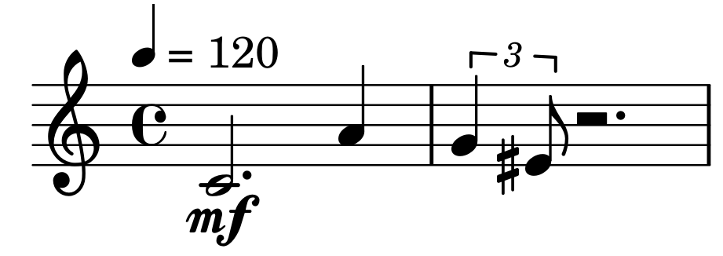

# mutwo

**Mutwo** is a flexible, modular, event based framework for composing music or other time-based arts in Python.
It aims to help composers to build musical structures in a meaningful way and translate those structures to different third party objects (e.g. midi files, [csound](https://csound.com/) scores, musical notation with [Lilypond](https://lilypond.org/) via [abjad](https://github.com/Abjad/abjad)).
The general design philosophy stresses out the independence and freedom of the user with the help of generic data structures and an easily extensible and tweakable software design.

The following example generates a short midi file:

```python3
from mutwo import core_events
from mutwo import music_events
from mutwo import midi_converters
simple_melody = core_events.SequentialEvent(
    [
        music_events.NoteLike(pitch_name, duration=duration, volume="mf")
        for pitch_name, duration in (
            ("c", 0.75),
            ("a", 0.25),
            ("g", 1 / 6),
            ("es", 1 / 12),
        )
    ]
)
event_to_midi_file = midi_converters.EventToMidiFile()
event_to_midi_file.convert(simple_melody, "my_simple_melody.mid")
```

Making Western notation via [abjad](https://github.com/Abjad/abjad) of the same melody:

```python3
from mutwo import abjad_converters
import abjad
abjad_voice_converter = abjad_converters.SequentialEventToAbjadVoice()
abjad_voice = abjad_voice_converter.convert(simple_melody)
abjad_score = abjad.Score([abjad.Staff([abjad_voice])])
abjad.show(abjad_score)
```




### Documentation

For more information how to use mutwo read the [documentation](https://mutwo.readthedocs.io/en/latest/).


### Modular design

Starting from version 0.43.0 mutwo uses a modular design.
Only basic functionality is provided by the mutwo core package.

#### Added internal functionality
- [mutwo.core](https://github.com/mutwo-org/mutwo.core): Base package for mutwo ecosystem
- [mutwo.music](https://github.com/mutwo-org/mutwo.music): Add music parameters (pitch, volume, ...) and a `SimpleEvent` based class to represent a Note/Chord/Rest (`NoteLike`)
- [mutwo.common](https://github.com/mutwo-org/mutwo.common): Algorithmic generation of data to be used for artistic works

#### Added conversion methods
- [mutwo.midi](https://github.com/mutwo-org/mutwo.midi): Write midi files
- [mutwo.abjad](https://github.com/mutwo-org/mutwo.abjad): Build [Lilypond based](lilypond.org/) Western score notation via [Abjad](abjad.github.io/)
- [mutwo.csound](https://github.com/mutwo-org/mutwo.csound): Create electronic music parts via [csound](csound.com/)
- [mutwo.isis](https://github.com/mutwo-org/mutwo.isis): Use singing synthesis via [ISiS](https://forum.ircam.fr/projects/detail/isis/)
- [mutwo.mbrola](https://github.com/mutwo-org/mutwo.mbrola): Render mutwo events to speaking synthesis signals via [mbrola](https://en.wikipedia.org/wiki/MBROLA)
- [mutwo.reaper](https://github.com/mutwo-org/mutwo.reaper): Helpful converters for the [Reaper](https://www.reaper.fm/) DAW
- [mutwo.ekmelily](https://github.com/mutwo-org/mutwo.ekmelily): Simplify writing microtonal notation in Lilypond by rendering files for the Lilypond extension [Ekmelily](http://ekmelic-music.org/en/extra/ekmelily.htm)
- [mutwo.mmml](https://github.com/mutwo-org/mutwo.mmml): Write music in plain text files and convert it to mutwo events (experimental)

Writing new plugins is simple, its basic structure can be understood at the [mutwo.example](https://github.com/mutwo-org/mutwo.example) repo.


### Similar projects

There are a many similar composition frameworks. Maybe one of them fits better to your particular use-case:

**Python based composition frameworks:**

- [scamp](http://scamp.marcevanstein.com/): "SCAMP is a computer-assisted composition framework in Python designed to act as a hub, flexibly connecting the composer-programmer to a variety of resources for playback and notation."
- [isobar](https://github.com/ideoforms/isobar): "isobar is a Python library for creating and manipulating musical patterns, designed for use in algorithmic composition, generative music and sonification."
- [JythonMusic](https://jythonmusic.me/): "JythonMusic is an environment for music making and creative programming."


**Composition frameworks in other languages:**

- [slippery-chicken](https://michael-edwards.org/sc/): "a Common Lisp and CLOS package for algorithmic composition."
- [OpenMusic](https://openmusic-project.github.io/): "OpenMusic (OM) is a visual programming language for computer-assisted music composition created at IRCAM, inheriting from a long tradition of computer-assisted composition research."
- [Euterpea](http://www.euterpea.com/): "Euterpea is a cross-platform, domain-specific language for computer music applications embedded in the Haskell programming language."
- [jMusic](http://explodingart.com/jmusic/): "jMusic is a project designed to provide composers and software developers with a library of compositional and audio processing tools."
- [Comic](https://github.com/simonbahr/Comic): "A Lisp-Environment for Inter-Media Composition."
